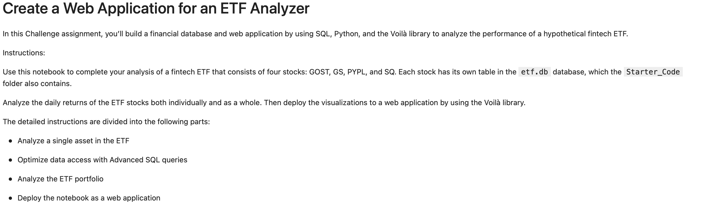

# **Create a Web Application for an ETF Analyzer**
In recent years, finance has had an explosion in passive investing. Passive investing means that you invest in a basket of assets that’s called an exchange-traded fund (ETF). This way, you don’t spend time researching individual stocks or companies or take the risk of investing in a single stock. ETFs offer more diversification.
In this Challenge assignment, you’ll build a financial database and web application by using SQL, Python, and the Voilà library to analyze the performance of a hypothetical fintech ETF.

---
## Technologies

This project leverages python 3.7 with the following:

**JupyterLab** - JupyterLab is a web-based user interface designed for data analysis.

**Pandas** - Flexible and powerful data analysis / manipulation library for Python.

**PyViz Ecosystem** - PyViz is a Python visualization package that provides a single platform for accessing multiple visualization libraries

**SQLAlchemy** - is an open-source SQL library for Python. It’s designed to ease the communication between Python-based programs and databases. 

**Voilà** - a Python library, you can convert a Jupyter notebook into a live webpage.

---
## Installation Guide

The following installation must be performed before running the program:

  *Install jupyterlab*
  
  *Install pandas*
  
  *Install hvplot*
  
  *Install sqlalchemy*
  
  *Install Voilà*

---
## Usage
This section is an explanation of how to use this program: 

First, program needs to analyze a single Asset in the ETF. You’ll use SQL queries with Python, Pandas, and hvPlot to analyze the performance of a single asset from the ETF.

Next, program optimizes Data Access with advanced SQL Queries and continues to analyze a single asset (PYPL) from the ETF. You’ll use advanced SQL queries to optimize the efficiency of accessing data from the database in two steps. First accessing the closing prices for PYPL that are greater than 200; and then finding the top 10 daily returns for PYPL. 

Next, program analyzes the entire ETF Portfolio and then evaluates its performance. To do so, you’ll build the ETF portfolio by using SQL joins to combine all the data for each asset.

Lastly, You need to deploy the Notebook as a Web Application. You will use the Voilà library to deploy your notebook as a web application. You can also deploy the web application locally on your computer.

Your results will look similar to the video in the Github repository!

Here is a screenshot: 

---
## Contributors

*Contributors*: Saina Azimi

*Email*: azimi.sainaa@gmail.com

*LinkedIn*: https://www.linkedin.com/in/azimi-saina/

---
## License

UC Berkeley